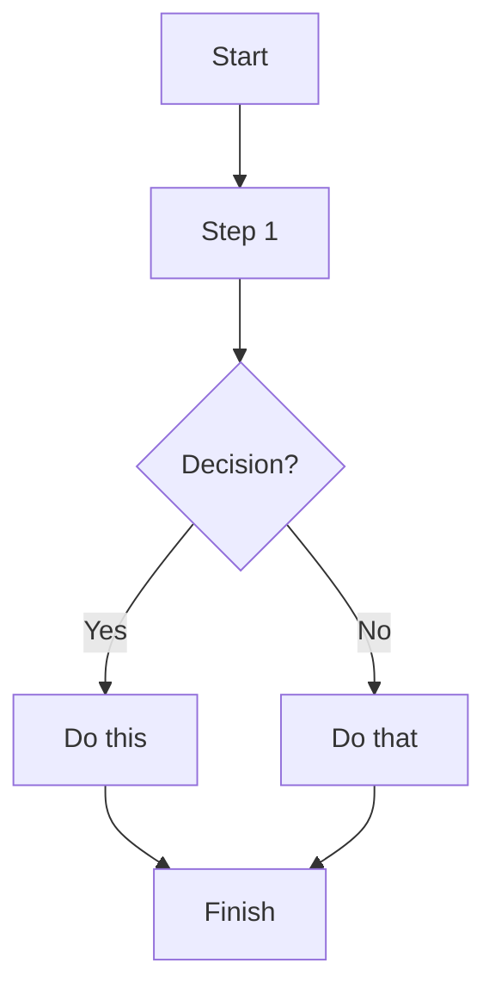

# Backup Concept

# Mermaid Test

## Objectives

1. **Preserve critical data even if services fail**

   * Ensure that if a VM or service is lost (corruption, misconfiguration, accidental deletion), its state can be restored from backup.
   * Service uptime depends on available hardware; backups guarantee the data survives until hardware is repaired or replaced.

2. **Meet module requirements for backup planning**

   * Define clear RPO and RTO per service tier (Critical, High, Medium, Low) and design backup schedules that align with these targets.
   * Use a **GFS 5-1-1 retention policy** to provide daily, weekly, and monthly restore points as required in M143.

    Note: **RPO** = Recovery Point Objective (max data loss)
          **RTO** = Recovery Time Objective (max downtime)

3. **Implement the 3-2-1 strategy within realistic limits**

   * **Onsite backup**: PBS datastore on the OptiPlex 1 TB HDD.
   * **Second medium**: external 1 TB USB disk (future expansion).
   * **Offsite copy**: optional cloud sync (AWS, GCP, Azure..).
   * A full OptiPlex hardware failure means temporary downtime, but data remains intact for restore.

4. **Cover all workload types**

   * Back up Proxmox VMs (Macmi-1/2), Hyper-V VMs (OptiPlex game servers), and camera recordings (SMB1 share).
   * Ensure consistency between paired services (AD-1/AD-2, netvps-1/2).

5. **Security and Integrity**

* Encryption for the cloud copy only

  * Offsite backups (AWS/GCP/Azure) will be handled with [**restic**](https://github.com/restic/restic), which encrypts all data by default with AES-256.
  * After the module, cloud + encryption can be disabled without affecting the local backup strategy.

* Local PBS datastore unencrypted

  * Backups on the OptiPlex HDD remain unencrypted for simplicity.
  * Since this is a trusted homelab environment, local encryption overhead is unnecessary, especially due to the low value data within the backed-up materials.

* SMB1 camera data (special case)

  * SMB1 is required for Xiaomi cameras.
  * The share is restricted to a minimal, isolated account with least privileges.

6. **Prove recovery through testing**

   * Demonstrate full VM restore (e.g., Ubuntu test VM).
   * Demonstrate file-level restore (e.g., Pi-hole config).
   * Demonstrate unstructured restore (camera clip).
     * Camera clip restore does not reintegrate into the Xiaomi app, but recovery is demonstrated by locating and playing back a recording file from the backup dataset.
   * Compare restore results to the defined RPO/RTO targets.

7. **Document and reflect**

   * Provide clear documentation, runbooks, and restore logs/screenshots for grading.
   * Reflect on limitations (scarce hardware) and propose improvements

## Tiers & Targets

| VM/Service                                                   | Priority Tier | Reason / Role                             | RPO (Max Data Loss) | RTO (Max Downtime) |
| ------------------------------------------------------------ | ------------- | ----------------------------------------- | ------------------- | ------------------ |
| **AD-1**                                                     | **Critical**  | Primary Active Directory / DNS root       | 6h                  | 1–2h               |
| **netvps-1**                                                 | **Critical**  | Pi-hole, DNS forwarder, internal services | 6h                  | 1–2h               |
| **AD-2**                                                     | Medium        | Secondary AD (consistency with AD-1)      | 6h                  | 48h                |
| **netvps-2**                                                 | Medium        | Secondary DNS forwarder (consistency)     | 6h                  | 48h                |
| **Game servers** (SCP, BeamMP, Zomboid, Minecraft, Unturned) | High          | Must be available for friends             | 24h                 | 1–2h               |
| **Public proxy (nginx-ext)**                                 | High          | Router for Public Services                | 24h                 | 24h                |
| **Public VPS (pubvps-1)**                                    | High          | Hosts public apps (It-Tools, OpenWebUI..) | 24h                 | 24h                |
| **Internal proxy (nginx-int)**                               | Low           | Only used internally, not even operational| 24h                 | 48h                |
| **Ubuntu test VM**                                           | Low           | School sandbox / dev / General Purpose    | 24h                 | 48h                |

## Strategy
- **Primary backup**: **Proxmox Backup Server (PBS)** VM on OptiPlex; datastore on the **1 TB HDD**
- **Retention (baseline)**: **GFS 5‑1‑1** → 5 daily incrementals, 1 weekly full, 1 monthly full
- **Alternative profiles**: 7-1-1, 5-2-1, 7-2-1 (depending on capacity)

- **3‑2‑1**: 3 copies (production + PBS + optional USB/cloud), 2 media types, 1 offsite (future extension)

## Capacity Overview
- Raw VM total: see `/tables/vm_inventory.csv`
- Scenario estimates: see `/tables/storage_estimates.csv`

## Risks & Mitigations
- **SMB1** required by Xiaomi cameras → isolate the share, least‑privilege user, mirror nightly to backup disk
- Single‑disk PBS datastore → consider offsite/USB copy and (later) immutability
