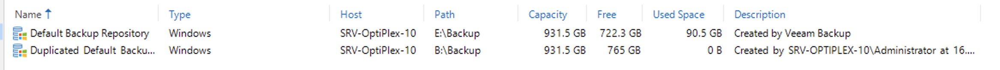
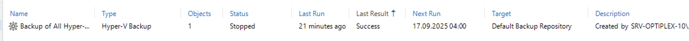
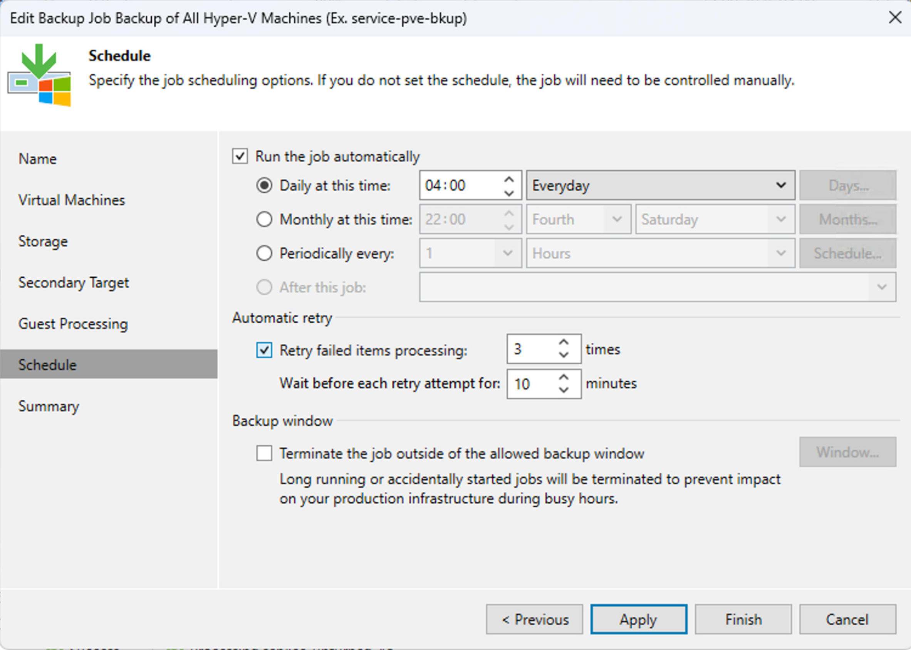
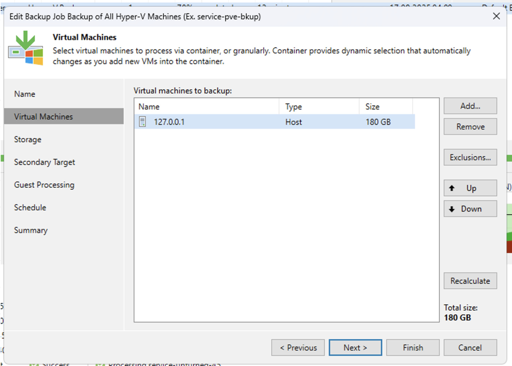
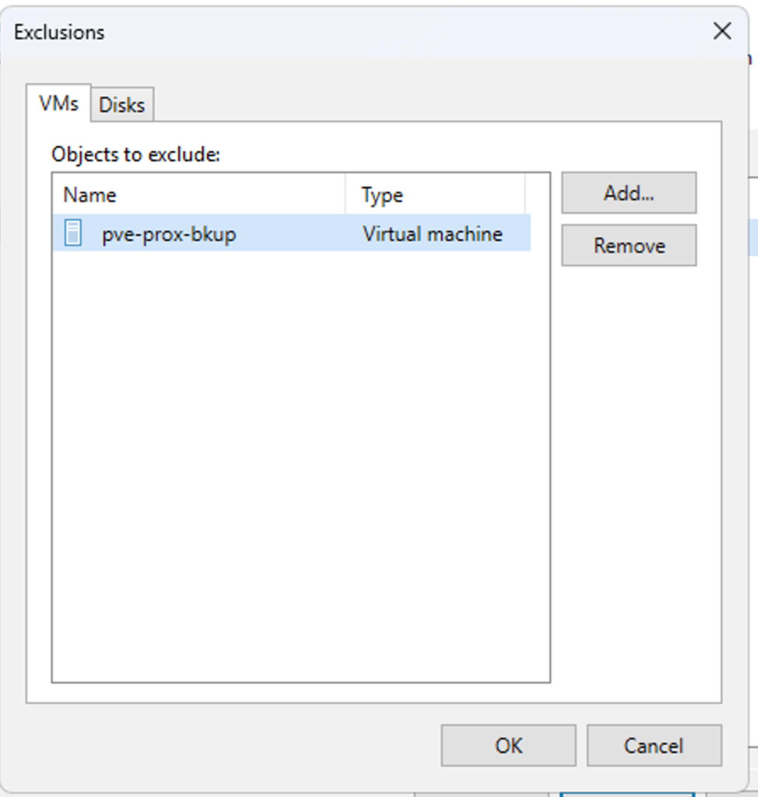
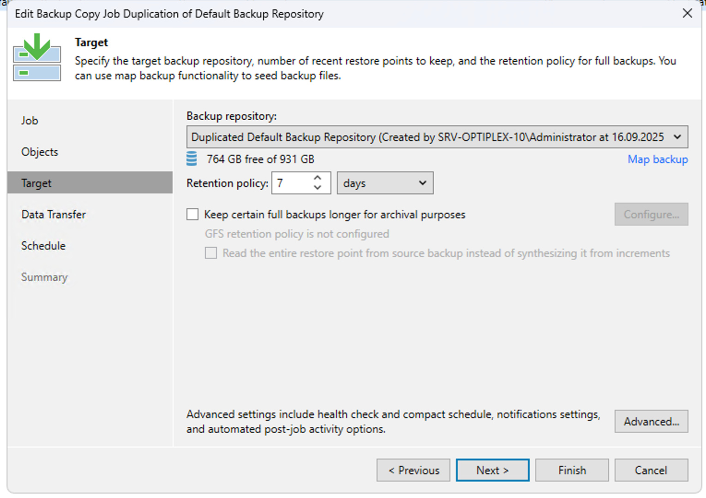
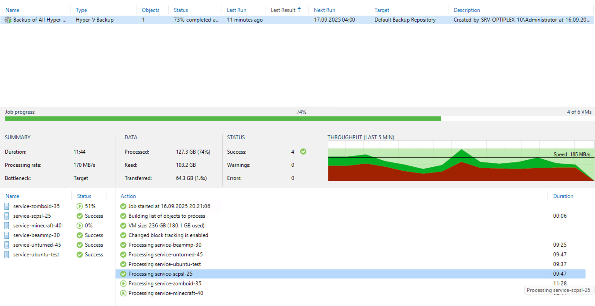

**[⬅ Back to README](/README.md)**

So for hyper-v i had a massive issue to solve, Proxmox solved much of the problems i had to find an answer to out of the box, thinks like incremental backups.. optimizing storage efficiency.. or even whole functions such as backup and restore and the file recover function. Hyper-V, lacks all of that out of the box.

After a prompt of research, i was recommended a Powershell script that would "Export" the vms or take snapshots as Hyper-V has some amount of API Accessible functionality, however that would be far from optimal and wouldn't have fixed my storage issue. Even Windows Server Backup function which is a built in feature for Windows Server machines, had me be talked out of it by my supervisor who said back in the day you'd immediately discard it.

However i was lucky enough that ChatGPT found me a perfect Match, Veeam Backup & Replication tool. Tends to be free, i immediately downloaded the Community Edition and began setting it up.

A key differentor of Veeam to say WSB (Windows Server Backup) is that Veeam actually uses the backend services that manage Hyper-V out of the box, so it is downright aware of what the VM is doing, much like Proxmox.. I didn't waste time and immediately installed it.

Once installed i created two backup repositories, these are where our backups will reside in. Again we're using 2 to apply the 3-2-1 rule.

With the Repos in place, i created the backup job which runs daily at 4 am.

Also specified i wanted to backup any and all VMs hosted, with exception our PBS vm.

After that, we created something similar to a Sync job, that ensures that everything on the default repo is copied over to our secondary repo for it to be the 2nd medium. It's important to note the Repo's are on two different physical disks.

And since that was all we had to do to get started, we'll start our first backup job.

No errors occcured during the backup.