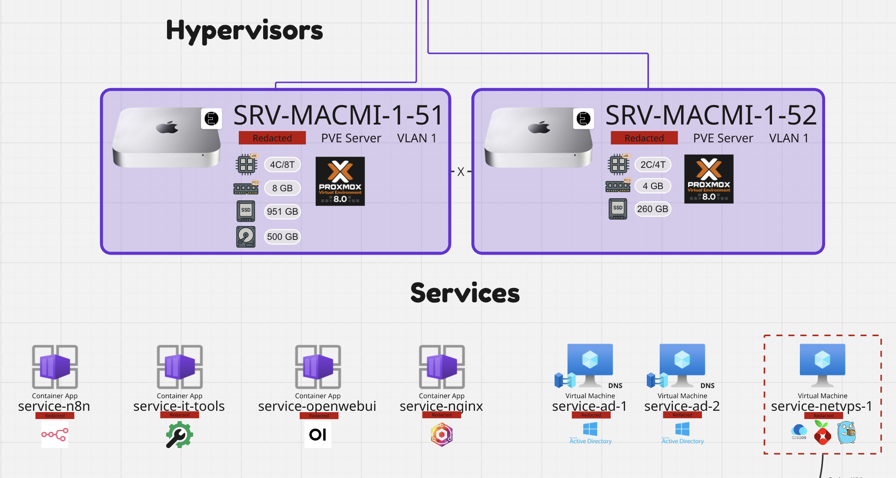
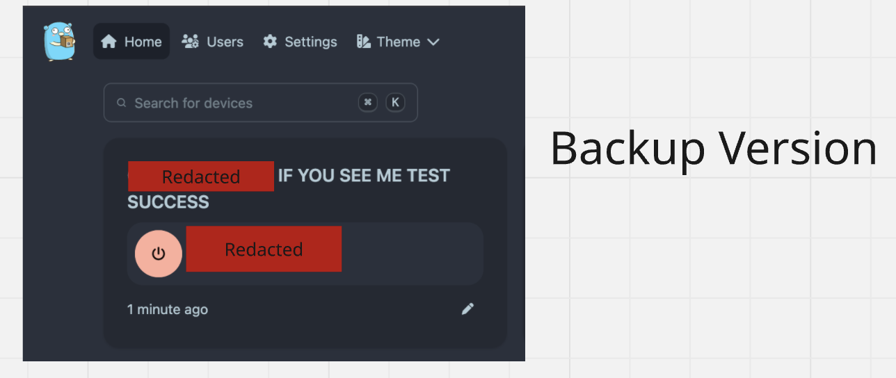
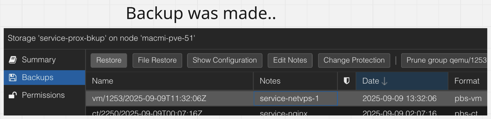
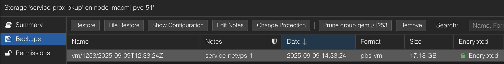
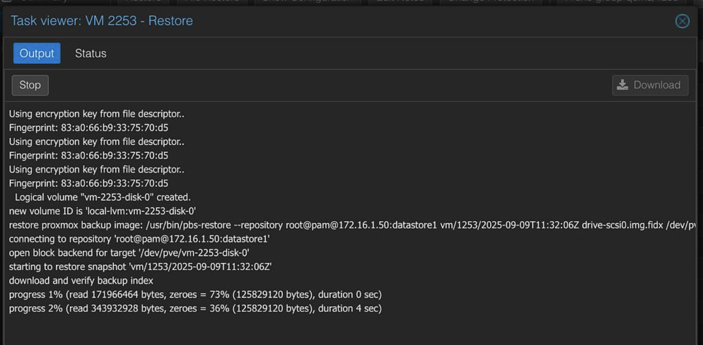
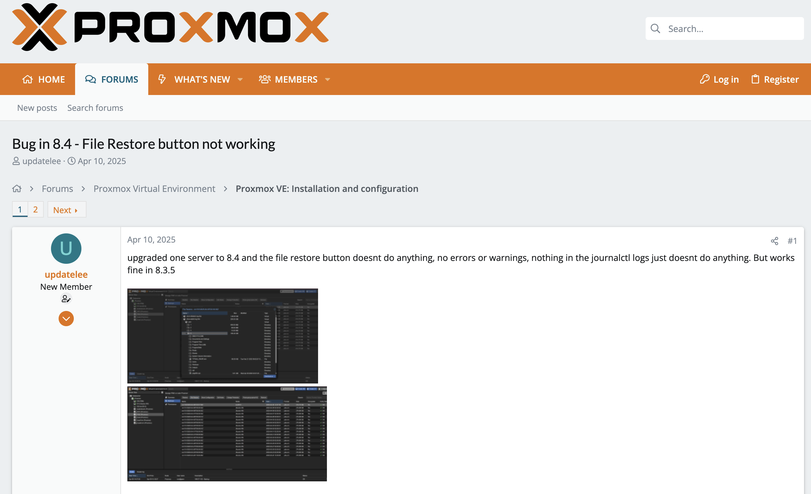
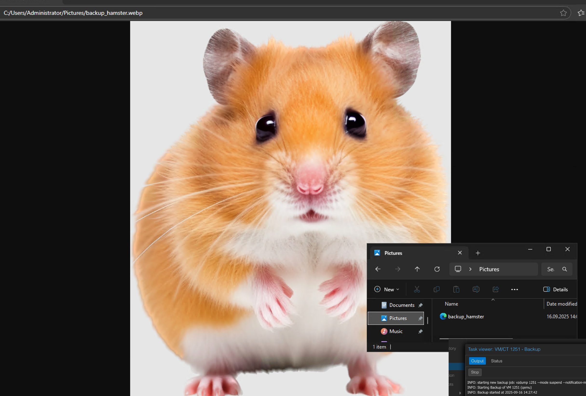
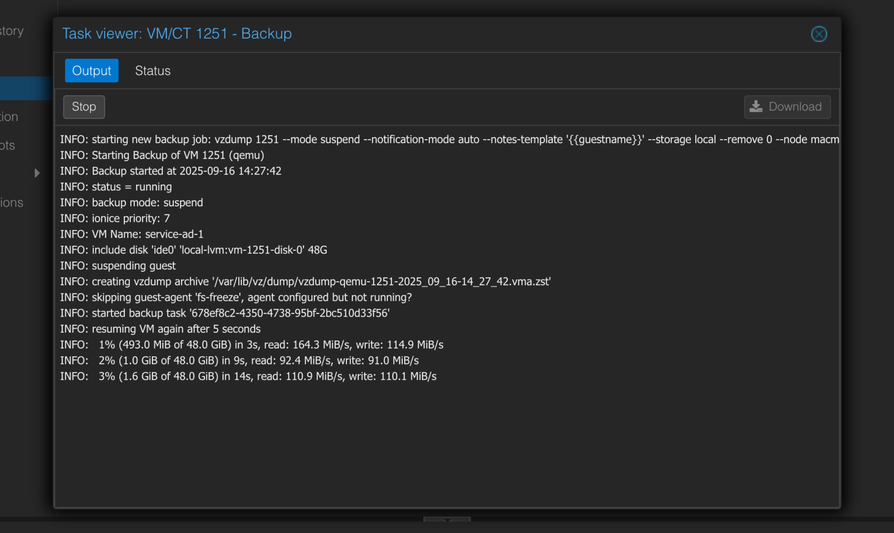
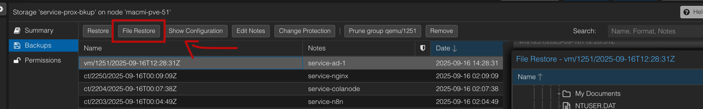
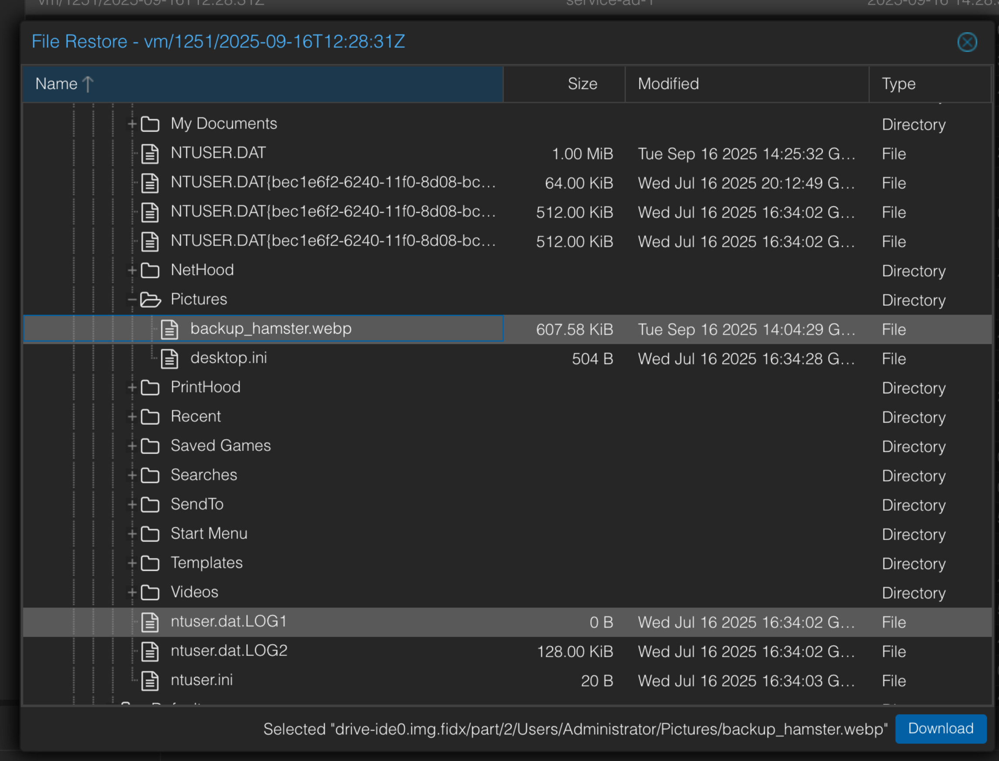

**[⬅ Back to README](/README.md)**

# Macmi-Cluster & Proxmox Backup Server

Our Proxmox cluster consists of two Mac Mini nodes. Together, they host the service stack, which includes a mix of small convenience services, experimental applications, and self-hosted services exposed via my website **giotech.ch**.

In this section, the focus is on conducting a **backup and restore cycle** of a single VM in Proxmox. The goal is to validate the functionality of the backup system and confirm that both full VM and file-level restores work as expected.

---

As a prerequisite, **RTO and RPO targets** were already defined, and a **7-1-1 retention scheme** (7 daily, 1 weekly, 1 monthly) was implemented. The following steps demonstrate the first test run.

For now, the setup relies entirely on the **Proxmox ecosystem**. Additional tools and procedures will be explored later when integrating Hyper-V workloads.

For this test, the VM **service-netvps-1** was selected. Before creating the backup, a modification was made inside the VM to later verify the restore process.

Inside one of the services hosted on netvps-1 (running CasaOS & Docker), the name of an item was intentionally changed. After applying this modification, the VM was shut down, and a backup was performed using Proxmox’s integrated backup functionality, with the target set to PBS running on Hyper-V.

The configuration ensures that backups are protected with **TLS encryption during transit**, and that the files are also **stored in encrypted form** on PBS.

Once the backup completed, the VM was restored. To avoid duplicate conflicts on the network, the original VM had to be deleted before performing the restore. Aside from this step, the process was seamless and functioned as intended.

---

After confirming that a **full VM restore** worked, the next objective was to test **file-level recovery**. Proxmox provides this functionality natively, though an issue arose during the first attempt: on version **8.4.0**, the file restore feature was unresponsive due to a known bug.

Following an upgrade (`apt update && apt dist-upgrade`) to **version 8.4.13**, the issue was resolved.

With the system updated, a file-level recovery test was carried out using the personal Domain Controller VM. For this purpose, an image of a hamster was saved in the Pictures folder, which was then targeted for restoration.

The Proxmox Web UI made it possible to browse the backup snapshot, locate the file, and prepare it for recovery.

The file was successfully extracted from the backup and restored to its original location, verifying that file-level recovery works as intended.

The restored hamster image confirmed the success of the procedure.

