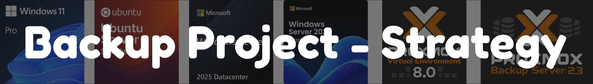

## Backup Objectives

1. **Preserve critical data even if services fail**
   - Ensure that if a VM or service is lost (corruption, misconfiguration, accidental deletion), its state can be restored from backup
   - Service uptime depends on available hardware; backups guarantee the data survives until hardware is repaired or replaced

2. **Meet module requirements for backup planning**
   - Define clear RPO and RTO per service tier (Critical, High, Medium, Low) and design backup schedules that align with these targets
   - Use a **7-1-1 retention policy** to provide daily, weekly, and monthly restore points as required in M143

   **Note**: RPO = Recovery Point Objective (max data loss), RTO = Recovery Time Objective (max downtime)

3. **Implement the 3-2-1 strategy within realistic limits**
   - **Primary backup**: PBS datastore on OptiPlex 1TB HDD
   - **Second medium**: Veeam clone jobs to secondary storage
   - **Offsite copy**: Proton Cloud synchronization
   - A full OptiPlex hardware failure means temporary downtime, but data remains intact for restore

4. **Cover all workload types**
   - Back up Proxmox VMs/Containers (Node 1, 2, 3)
   - Back up Hyper-V VMs (OptiPlex game servers) - **Note: Currently retired**
   - Ensure consistency between paired services (AD-1/AD-2)

## Service Tiers & Recovery Targets

| VM/Service | Priority Tier | Reason / Role | RPO (Max Data Loss) | RTO (Max Downtime) | Current Size |
|------------|---------------|---------------|---------------------|-------------------|--------------|
| **service-ad-1** | **Critical** | Primary Active Directory / DNS root | 24h | 1–2h | 48GB |
| **service-netvps-1** | **Critical** | Pi-hole, DNS forwarder, internal services | 24h | 1–2h | 16GB |
| **service-ad-2** | Medium | Secondary AD (consistency with AD-1) | 24h | 48h | 48GB |
| **service-openwebui** | High | AI/LLM interface for development | 24h | 24h | 48GB |
| **service-it-tools** | Low | Development utilities | 24h | 48h | ~12GB |
| **service-n8n** | Low | Automation workflows | 24h | 48h | ~12GB |
| **service-colanode** | Low | Collaborative tools | 24h | 48h | ~12GB |
| **service-nginx** | High | Public reverse proxy | 24h | 24h | ~12GB |
| **vm-ubuntu** | Low | Test/development VM | 24h | 48h | ~16GB |

*Note: VMs were categorized by criticallity to the Network and or HomeLab, Critical/High Priority tier may cause a Ripple effect and take down the entire network and or has failover replacement.

## Current Infrastructure Overview

### Active Nodes & Services

**Node 1 (macmi-pve-51)** - Primary Production Node
- **Hardware**: Mac Mini 2012, i7 Quad-core, 16GB RAM, 500GB SSD
- **Services**: 
  - service-openwebui (48GB) - AI/LLM interface
  - service-it-tools (~12GB) - Development utilities
  - service-n8n (~12GB) - Automation workflows
  - service-colanode (~12GB) - Collaborative platform
  - service-nginx (~12GB) - Public reverse proxy
  - service-ad-1 (48GB) - Primary domain controller
  - service-netvps-1 (16GB) - Pi-hole & internal services

**Node 2 (macmi-pve-52)** - Secondary Node
- **Hardware**: Mac Mini 2012, i5 Dual-core, 8GB RAM, 256GB SSD  
- **Services**:
  - service-ad-2 (48GB) - Secondary domain controller

**Node 3 (macmi-pve-53)** - Expansion Node
- **Hardware**: MacBook Pro 2019, i5 Quad-core, 8GB RAM, 500GB SSD
- **Services**:
  - vm-ubuntu (~16GB) - Test/development environment
- **Status**: Mostly unused, available for expansion

**Total Protected Data**: ~244GB (Proxmox VMs/Containers only)

## Backup Tools & Implementation

### Proxmox Backup Server (PBS)
- **Primary Tool**: Handles all Proxmox VMs and containers
- **Location**: Running on OptiPlex Server (Hyper-V VM)
- **Datastore**: 1TB HDD on OptiPlex
- **Retention**: 7-1-1 policy (7 daily, 1 weekly, 1 monthly)
- **Encryption**: Built-in PBS encryption with encryption key
- **Schedule**: Daily backups between 02:00-06:00

### Veeam Backup & Replication
- **Secondary Tool**: Handles PBS VM backup and clone jobs
- **Clone Jobs**: B: drive to C: drive (into Proton folder)
- **Encryption**: Built-in Veeam encryption (AES-256)
- **Cloud Integration**: Automatic sync to Proton Cloud
- **Retention**: Managed automatically with 7-1-1 policy

## Backup Strategy Implementation

### Daily Backup Process (02:00-06:00)
1. **Proxmox Nodes**: PBS automatically backs up all VMs/containers
2. **PBS VM**: Veeam backs up the PBS VM itself 
3. **Clone Jobs**: Veeam clones backups from HDD to SSD (Proton folder)
4. **Cloud Sync**: Proton automatically uploads to cloud storage

### Encryption Strategy
- **In Transit**: TLS encryption for all PBS communication between nodes
- **At Rest**: PBS datastore encrypted with encryption key
- **Cloud Storage**: Veeam encryption before Proton Cloud upload
- **Transport Security**: All backup traffic protected via internal VLAN

### 3-2-1 Implementation
- **3 Copies**: Original data + PBS backup + Veeam clone
- **2 Media Types**: SSD (primary) + HDD (backup) + Cloud (offsite)  
- **1 Offsite**: Proton Cloud storage via automatic sync

## Storage Capacity Planning

### Current Usage Estimates
- **Node 1 Services**: ~160GB (openwebui 48GB + others ~112GB)
- **Node 2 Services**: ~48GB (AD-2)
- **Node 3 Services**: ~16GB (vm-ubuntu)
- **Total Raw Data**: ~224GB
- **7-1-1 Retention Factor**: ~3.3x multiplier
- **Estimated Backup Storage**: ~740GB (within 1TB limit)

### Storage Allocation
| Storage Device | Capacity | Usage | Purpose |
|----------------|----------|-------|---------|
| OptiPlex HDD (B:) | 1TB | ~740GB | PBS primary datastore (VHDX disk 1) |
| OptiPlex SSD (C:) | 1TB | ~200GB | Temporary staging for Proton Cloud sync only |
| OptiPlex USB | 1TB | ~740GB | PBS secondary datastore (VHDX disk 2) |

**Storage Flow**: 
- **Primary**: PBS writes to HDD (B:)
- **Local Redundancy**: Veeam replicates B: → USB drive  
- **Cloud Backup**: Veeam clones B: → C: (temporary staging) → Proton Drive app uploads to cloud

**Note**: C: drive serves purely as temporary staging area for cloud uploads via Proton Drive app. All actual backup storage occurs on B: (primary) and USB (replica).

## Monitoring & Alerting

### Automated Monitoring
- **PBS Email Alerts**: Backup completion and failure notifications
- **Veeam Notifications**: Job status and clone operation alerts
- **Manual Verification**: Weekly backup integrity checks

### Failure Handling
- **Automatic Retries**: PBS and Veeam built-in retry mechanisms
- **Manual Investigation**: Log analysis when automatic recovery fails
- **Hardware Monitoring**: Disk health monitoring (current B: drive showing CRC errors)

## Testing & Validation

### Completed Tests
- **File-Level Restore**: Successfully tested with Veeam file restore
- **Full VM Restore**: Complete VM recovery verification
- **PBS Integration**: Proxmox snapshot and restore functionality

### Recovery Procedures

#### Normal Recovery Operations
1. **Proxmox VMs/Containers**: 
   - **File Recovery**: PBS file-level restore for individual files within VMs
   - **VM Recovery**: Complete VM/container restoration from PBS snapshots via Proxmox interface
2. **Hyper-V VMs** (Game Servers):
   - **File Recovery**: Veeam file-level restore for Windows Server instances
   - **VM Recovery**: Complete VM restoration via Veeam from local repository

#### Disaster Recovery (Complete Infrastructure Loss)
**Scenario**: All physical hardware (OptiPlex + Mac Minis) requires replacement

**Recovery Sequence**:
1. **Replace Hardware**: Acquire replacement OptiPlex server and Mac Mini nodes
2. **Restore Backup Infrastructure**: 
   - Install Veeam on new OptiPlex server
   - Restore PBS VM from Proton Drive repository via Veeam
3. **Rebuild Proxmox Cluster**: Set up new Mac Mini nodes with Proxmox VE
4. **Restore Production Services**: Use restored PBS to recover all Proxmox VMs/containers to new cluster
5. **Restore Game Servers**: Direct Veeam restore of Hyper-V VMs once Hyper-V role is installed

**Recovery Dependencies**: 
- Proton Drive desktop app installation (provides Explorer-like access to cloud repository)
- Hardware replacement availability 
- Internet connectivity for cloud repository access

## Known Limitations & Risks

### Hardware Constraints
- **Budget Limitation**: €0 budget constrains hardware upgrades
- **Failing Hardware**: B: drive showing CRC errors and mechanical issues
- **Backup Infrastructure Dependency**: OptiPlex serves as dedicated backup server (PBS + Veeam) - failure affects backup capability but not primary services

### Risk Mitigation
- **Regular Monitoring**: Daily verification of backup job completion
- **Cloud Redundancy**: Offsite storage via Proton Cloud
- **Documentation**: Comprehensive restore procedures documented
- **Hardware Awareness**: Known disk issues documented for replacement planning

---
*Last Updated: September 2025*  
*Module 143: Backup- und Restore-Systeme implementieren*
