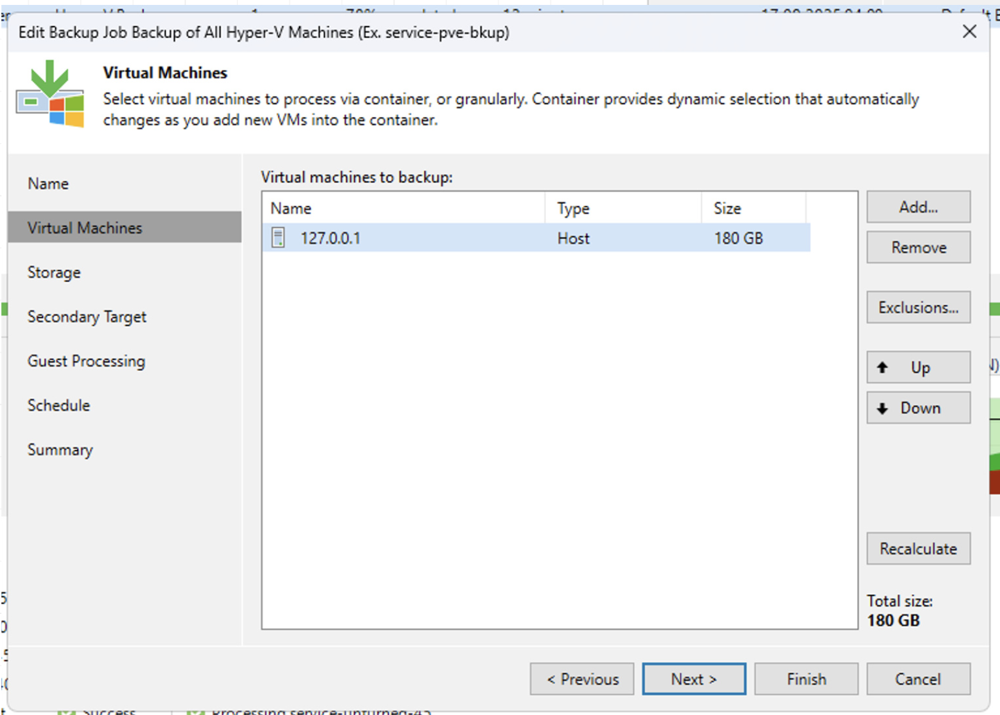
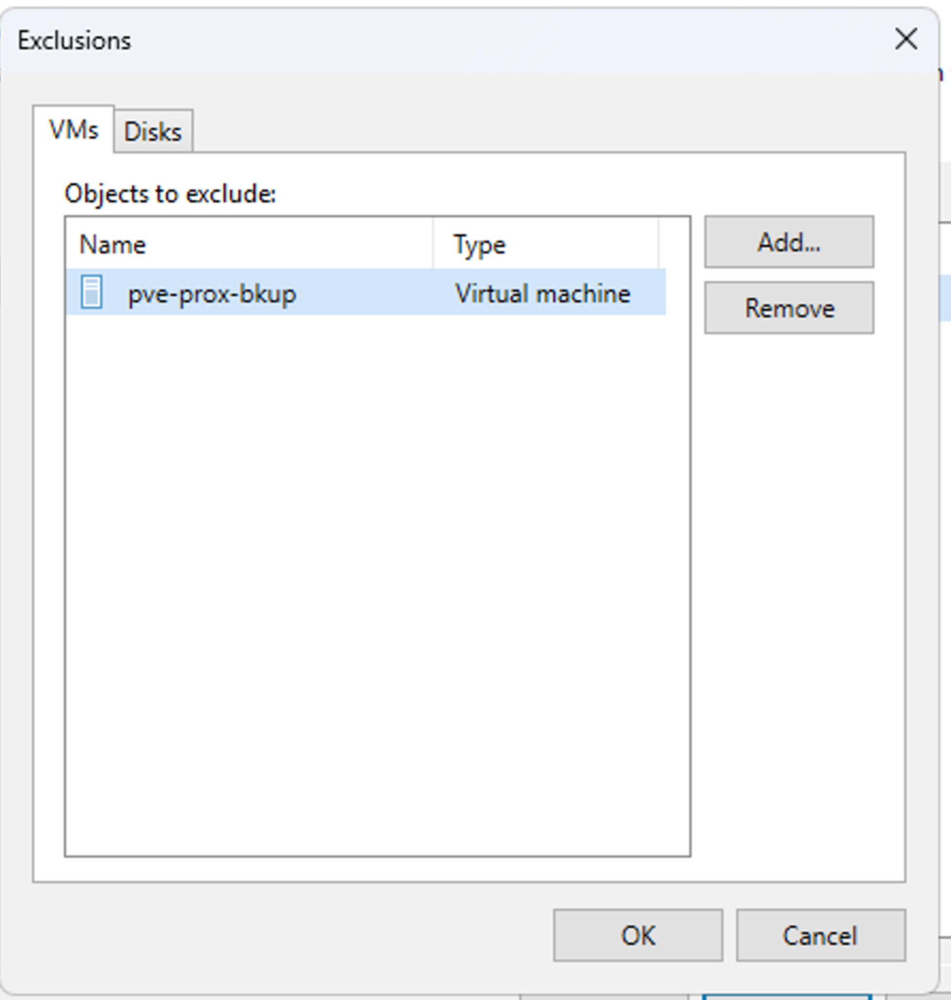
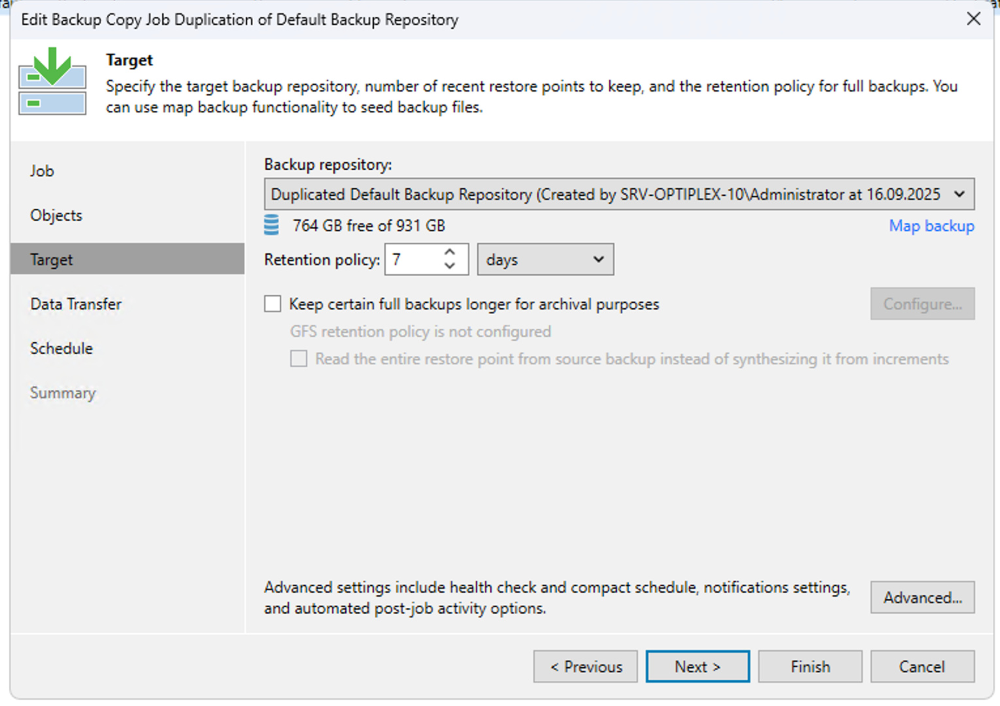
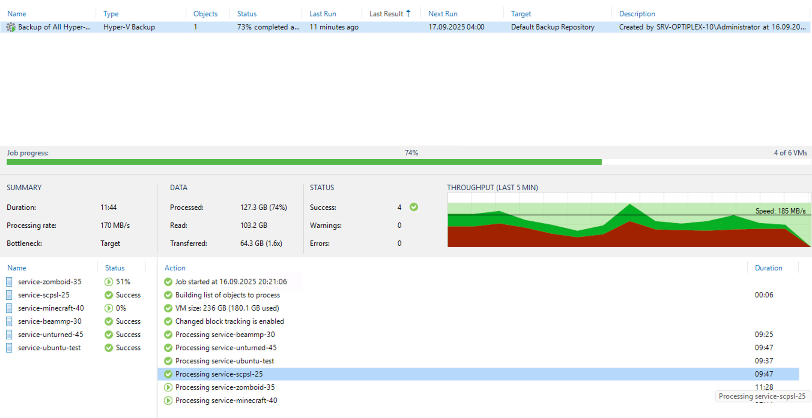

**[⬅ Back to README](/README.md)**

So for hyper-v i had a massive issue to solve, Proxmox solved much of the problems i had to find an answer to out of the box, thinks like incremental backups.. optimizing storage efficiency.. or even whole functions such as backup and restore and the file recover function. Hyper-V, lacks all of that out of the box.

After a prompt of research, i was recommended a Powershell script that would "Export" the vms or take snapshots as Hyper-V has some amount of API Accessible functionality, however that would be far from optimal and wouldn't have fixed my storage issue. Even Windows Server Backup function which is a built in feature for Windows Server machines, had me be talked out of it by my supervisor who said back in the day you'd immediately discard it.

However i was lucky enough that ChatGPT found me a perfect Match, Veeam Backup & Replication tool. Tends to be free, i immediately downloaded the Community Edition and began setting it up.

A key differentor of Veeam to say WSB (Windows Server Backup) is that Veeam actually uses the backend services that manage Hyper-V out of the box, so it is downright aware of what the VM is doing, much like Proxmox.. I didn't waste time and immediately installed it.

Once installed i created two backup repositories, these are where our backups will reside in. Again we're using 2 to apply the 3-2-1 rule.

With the Repos in place, i created the backup job which runs daily at 4 am.

Also specified i wanted to backup any and all VMs hosted, with exception our PBS vm.

After that, we created something similar to a Sync job, that ensures that everything on the default repo is copied over to our secondary repo for it to be the 2nd medium. It's important to note the Repo's are on two different physical disks.

And since that was all we had to do to get started, we'll start our first backup job.

No errors occcured during the backup.

So we'll conclude to attempting our restore. this time in an effort to try and save time, we will just delete a vm entirely and pray that the restore works, it's more relaistic if we think about it.

First i'll attempt to verify that the backup image exists, then i'll remove the specified VM below, and attempt a full VM Restore.

I must mention there's a exciting amount of options with Veeam. We'll go for Entire VM Restore. We'll however proceed to select the service-zomobid game server vm.

We can see, that it detects both our Repo's (cloned after eachother) and gives us the option to search our vm from our backups.

After the VM was deleted, and the Harddisk manually aswell.. we can proceed with our Restore test.

We'll restore it to the original location, in an attempt to get a 1:1 as it was restoration.

And that easily it's already installing. And after about 3 minutes, we have our VM back.

Genuienly shocking how easy that was.

Let's see weather recovering singular files from a backup is just as easy, for that we'll just choose guest file restore when the option arises.

This time it asks us whithin the backup weather we wish to restore a file from the incremental one, or the last full backup.

I selected the Incremental one, since it's the newest, hoping it smartly accessed the full backup behind the szenes to allow me to effortlessly browse the entirety of the system. We're also using service-zomboid for this.

Incredible.. We have all our files to our disposal and, unlike proxmox we have the option to restore the file(s) itself directly to the productive VM, without having to download it ourselves and post it into the original place..

This concludes our File Restoration Test.. which allows us to move on to the last part of our concept.. the Cloud backup.

And veeam got us covered here, however instead of using AWS, Google Cloud or Azure.. Which i could no doubts do, and super cool veeam actually supports pretty much out of the box, and even offers extentions for applications not offered out of the box like in this case AWS..

But i chose to doube down on security, reliability.. and by all means ease of access.. So i choose to use my Encrypted Proton Cloud.. My backups sum up to around 600-800gb which is wildely below my estimates and calculations within the concept, thanks to proxmox's and veeams incredible storage efficiency.. however.. this gives me just enough breathing room to push the updates using veeam straight to my proton encrypted secure cloud.

The implementation is quite easy, we just add another Backup Repo.. and because this is a Windows System running Veeam it simply integrates into the C Drive, and the Proton Application automatically Syncs changes up to the cloud.

The data will temporarily be stored on the C Drive, which we can thankfully handle without making a big huss out of it.

