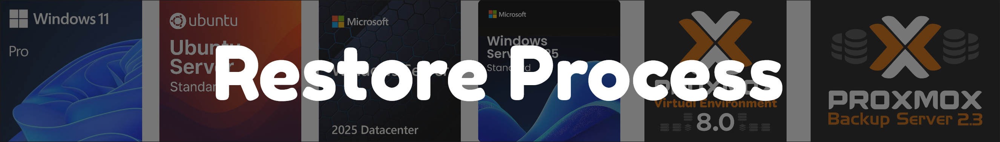

# Backup Restore Process

## Overview

This document outlines the restore procedures for both Proxmox (PBS) and Hyper-V (Veeam) environments within our homelab backup infrastructure. All restore procedures have been thoroughly tested with successful results for both full VM restoration and file-level recovery.

## Proxmox Backup Server (PBS) Restore Procedures

### Full VM Restore

**Tested Environment**: Proxmox VE 8.4.13 → PBS on OptiPlex  
**Test Subject**: service-netvps-1 (CasaOS & Docker services)

#### Prerequisites
- PBS datastore accessible and healthy
- Target Proxmox node has sufficient storage capacity
- VM to be restored must be powered off or removed to avoid conflicts

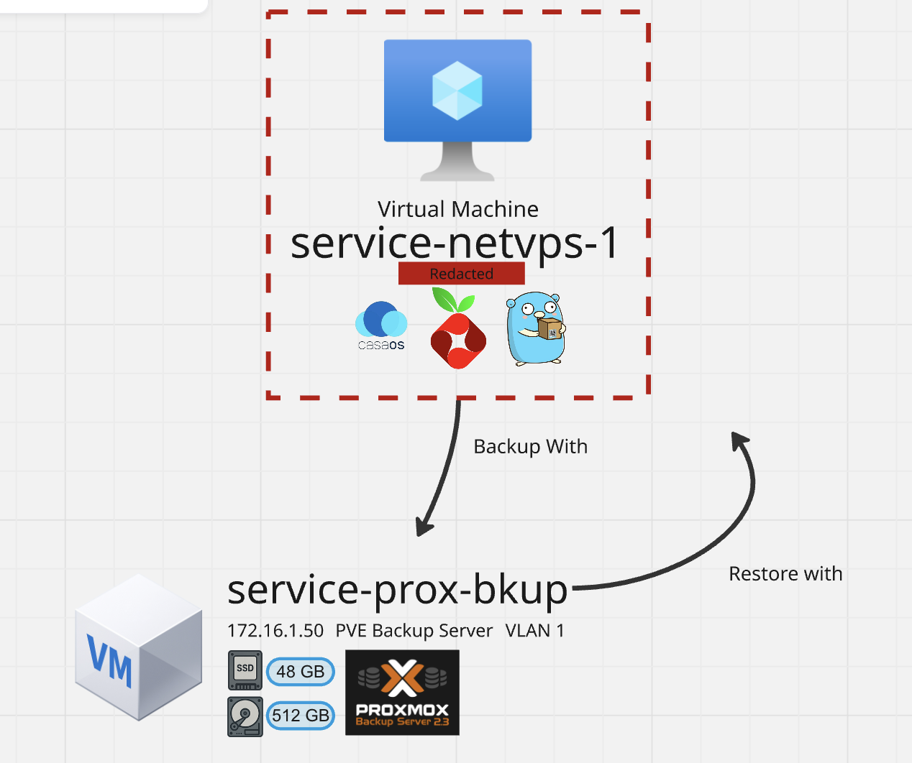

#### Test Setup
Before initiating the backup, a deliberate modification was made inside the VM to validate the restore process accuracy.

Inside one of the services hosted on netvps-1 (running CasaOS & Docker), the name of an item was intentionally changed. After applying this modification, the VM was shut down, and a backup was performed using Proxmox's integrated backup functionality, with the target set to PBS running on Hyper-V.

#### Restore Process
1. **Access Proxmox Web UI** → Navigate to target node
2. **Select Backup Location** → Choose PBS datastore 
3. **Browse Available Backups** → Locate desired VM backup snapshot
4. **Initiate Restore** → Select restore point (daily/weekly/monthly from 7-1-1 retention)
5. **Configure Restore Options**:
   - Restore to original location (default)
   - Verify storage target has adequate space
   - Confirm network configuration to avoid conflicts

6. **Execute Restore** → Monitor progress via Proxmox task viewer

**Tested Results**: Full VM restoration completed successfully with all services intact. CasaOS configuration and Docker containers restored to exact pre-backup state.

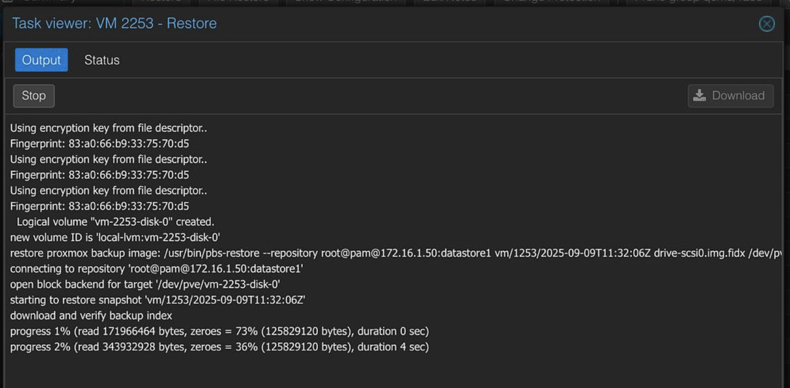

#### Security Features
- **Transport Encryption**: All data transfer protected by TLS between Proxmox nodes and PBS
- **At-Rest Encryption**: Backup data stored encrypted on PBS datastore
- **Authentication**: Proxmox API tokens secure access to PBS

### File-Level Recovery

**Tested Environment**: Proxmox VE 8.4.13 (Note: Version 8.4.0 had known file restore bug)  
**Test Subject**: Domain Controller VM - hamster image recovery from Pictures folder

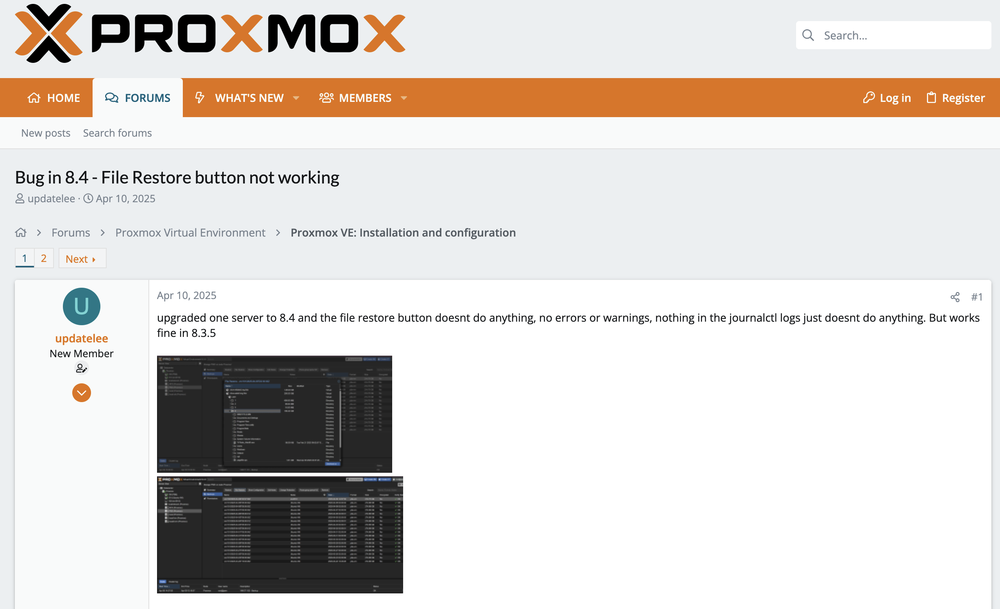

Following an upgrade (`apt update && apt dist-upgrade`) to version 8.4.13, the file restore issue was resolved.

#### Prerequisites  
- Proxmox VE version 8.4.13 or later (earlier versions may have file restore issues)
- PBS backup containing target files
- Write access to target VM filesystem

#### Recovery Process
1. **Navigate to PBS Interface** → Access via Proxmox datacenter view
2. **Browse Backup Contents** → Select specific backup snapshot
3. **File System Navigation** → Browse VM filesystem structure within backup

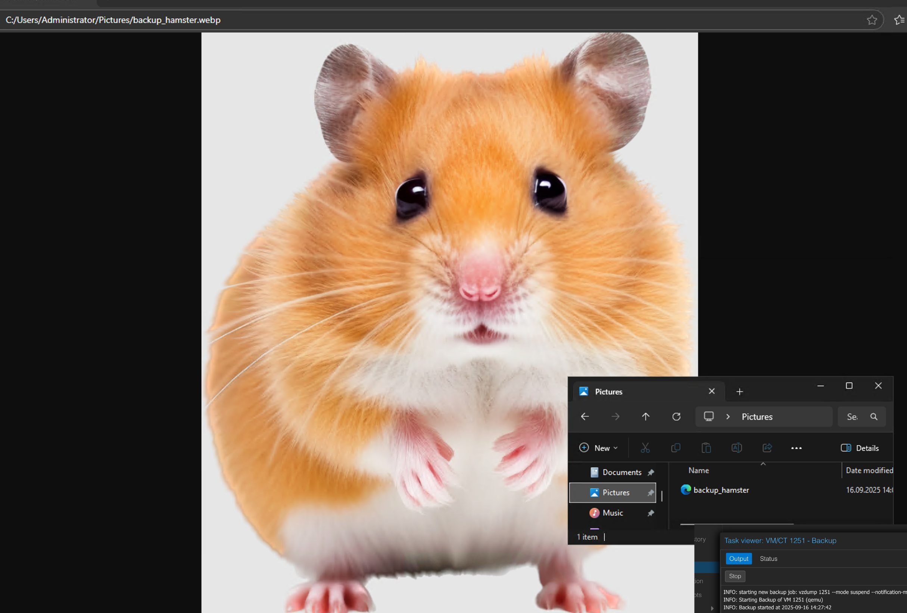

4. **Locate Target Files** → Navigate to specific directories/files for recovery

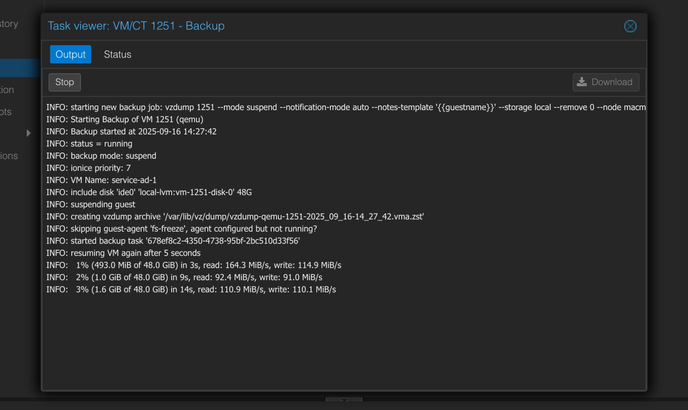

5. **Download/Extract Files** → PBS provides direct download capability

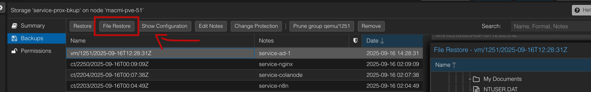

6. **Manual File Placement** → Place recovered files in target VM locations

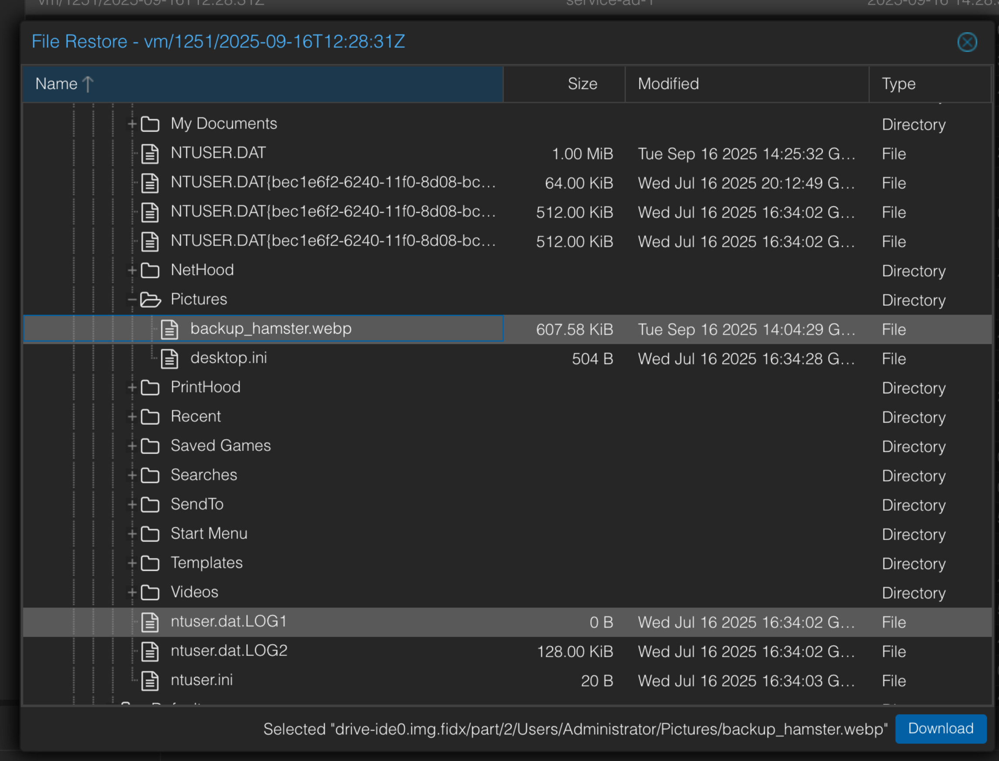

**Tested Results**: Successfully recovered individual image file from Windows VM Pictures folder. File integrity confirmed post-recovery - the restored hamster image verified the success of the procedure.

#### Limitations
- **Manual Process**: Unlike Veeam, PBS requires manual file placement after download
- **Version Dependency**: File restore feature requires Proxmox VE 8.4.13+
- **Guest Agent**: Some functionality may require Proxmox guest agent installation

## Veeam Backup & Replication Restore Procedures

### Full VM Restore

**Tested Environment**: Veeam Community Edition on Windows Server 2025  
**Test Subject**: service-zomboid (Game server VM)

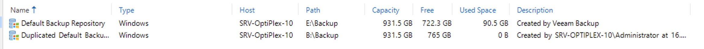

#### Prerequisites
- Veeam Backup & Replication installed and licensed
- Access to backup repositories (local HDD and USB replicas)
- Hyper-V host with adequate resources
- Target VM removed if restoring to original location

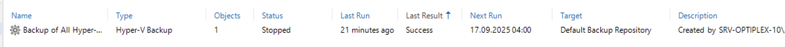

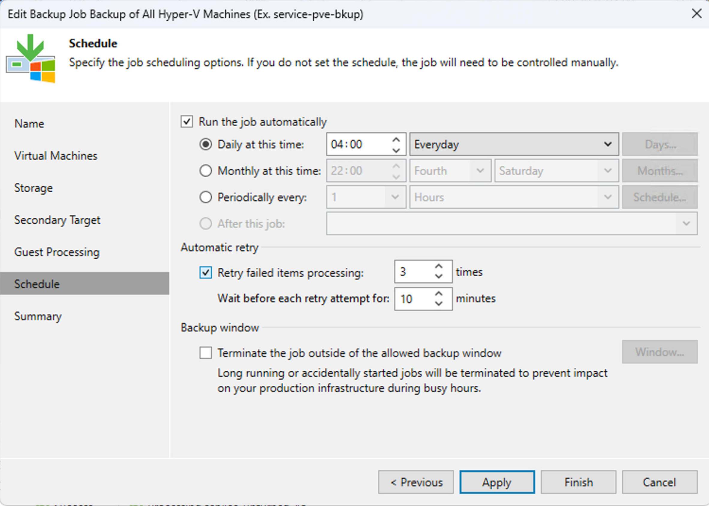

#### Test Setup
To provide a realistic restore scenario, the service-zomboid VM was completely deleted, including manual removal of the hard disk files.

#### Restore Process
1. **Launch Veeam Console** → Access Backup & Replication interface
2. **Navigate to Restore** → Select "Entire VM restore" option

3. **Choose Backup Source** → Select from available repositories (detects both primary HDD and USB replicas)
4. **Browse VM Backups** → Locate target VM in backup catalog
5. **Select Restore Point** → Choose from available incremental or full backup points
6. **Configure Restore Options**:
   - Restore to original location (tested configuration)
   - Verify Hyper-V host selection
   - Confirm storage path and network settings

7. **Execute Restore** → Monitor restore progress

**Tested Results**: Complete VM restore executed flawlessly in approximately 3 minutes. service-zomboid game server restored with full functionality, all configurations intact.

#### Advanced Features
- **Repository Selection**: Automatically detects multiple backup repositories
- **Point-in-Time Recovery**: Choose specific backup snapshots from retention policy
- **Quick Recovery**: Optimized restore process with minimal downtime

### File-Level Recovery (Guest File Restore)

**Tested Environment**: Veeam Community Edition  
**Test Subject**: service-zomboid - individual file recovery

#### Prerequisites
- Veeam backup containing target VM
- VM can be online during file restore process
- Sufficient permissions on target system

#### Recovery Process
1. **Access Veeam Console** → Navigate to restore options
2. **Select Guest File Restore** → Choose file-level recovery option

3. **Choose Backup Point** → Select incremental or full backup snapshot

4. **Mount Backup** → Veeam mounts backup as browsable filesystem
5. **Navigate File Structure** → Browse complete VM filesystem within backup

6. **Select Target Files** → Choose specific files/folders for recovery
7. **Configure Restore Destination**:
   - **Direct VM Restore**: Files restored directly to running VM (tested method)
   - **Alternative Location**: Save to different location if needed

8. **Execute File Restore** → Automatic placement in original VM location

**Tested Results**: Individual file recovery completed seamlessly with direct restoration to productive VM. Superior user experience compared to PBS manual process.

#### Key Advantages
- **Live VM Restore**: Files can be restored to running VMs without downtime
- **Direct Integration**: Automatic file placement in original VM locations  
- **Intelligent Backup Access**: Seamlessly accesses full backup chain for complete filesystem view
- **No Manual Intervention**: Unlike PBS, no manual download/upload process required

## Disaster Recovery Procedures

### Complete Infrastructure Loss Scenario

**Recovery Sequence for Total Hardware Failure**:

#### Phase 1: Infrastructure Rebuild
1. **Replace Hardware**: Acquire replacement OptiPlex server and Mac Mini nodes
2. **Install Base Systems**: 
   - Windows Server 2025 on OptiPlex
   - Proxmox VE on Mac Mini nodes
   - Configure basic networking (VLANs, IP addressing)

#### Phase 2: Backup Infrastructure Recovery
1. **Install Veeam**: Deploy Veeam Backup & Replication on new OptiPlex
2. **Install Proton Drive**: Download and configure Proton Drive desktop app
3. **Access Cloud Repository**: Connect to Proton Drive cloud storage via desktop app
4. **Restore PBS VM**: Use Veeam to restore PBS VM from cloud repository
5. **Configure PBS Access**: Establish connection between new Proxmox cluster and restored PBS

#### Phase 3: Service Recovery
1. **Restore Proxmox VMs**: Use restored PBS to recover all production VMs to new cluster
2. **Restore Hyper-V VMs**: Direct Veeam restore of game servers (if replacement OptiPlex includes Hyper-V)
3. **Validate Services**: Verify all restored services function correctly
4. **Resume Backup Operations**: Re-establish automated backup schedules

**Recovery Dependencies**:
- Proton Drive desktop app installation (provides Explorer-like access to cloud repository)
- Hardware replacement availability
- Internet connectivity for cloud repository access
- Valid Veeam licensing for new installation

**Estimated Recovery Time**: 
- **Infrastructure Setup**: 4-8 hours
- **PBS VM Recovery**: 1-2 hours  
- **Production Service Recovery**: 2-4 hours
- **Total RTO**: 8-14 hours (within defined targets for most services)

## PBS Redundancy & Cloud Backup Implementation

### Local Redundancy (3-2-1 Strategy - Second Medium)

To comply with the 3-2-1 backup strategy, specifically the *two media* requirement, the Proxmox Backup Server (PBS) was extended with an additional storage medium.

A 1TB HDD was physically attached to the host server, and an additional 512GB virtual disk (.vhdx) was assigned to the PBS VM. This resulted in two independent datastores of equal size (512GB each).

Both datastores were integrated into PBS with a Local Sync Job created to replicate the contents of Datastore1 onto Datastore2.

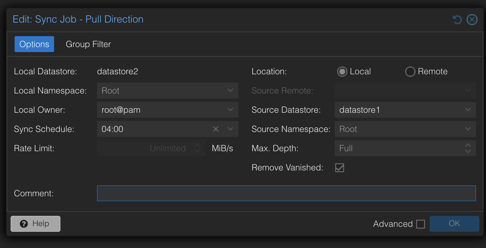

The job configuration ensures that the target datastore remains synchronized and that notifications are sent via email upon successful completion or in case of errors.

### Cloud Backup Integration

For the third element of the 3-2-1 strategy (offsite storage), the system integrates with Proton Cloud through a simple yet effective approach.

The implementation utilizes Veeam's repository cloning capabilities combined with the Proton Drive desktop application. Veeam creates a backup repository on the C: drive, and the Proton Application automatically synchronizes changes to the cloud.

This approach provides encrypted, secure offsite backup storage while maintaining simplicity and cost-effectiveness for the homelab environment.

### Repository Health Monitoring
- **Known Issues**: Primary HDD (B:) showing CRC errors and mechanical grinding
- **Mitigation**: USB replica provides immediate fallback capability
- **Cloud Backup**: Ensures offsite recovery capability despite local hardware issues

## Testing & Validation Summary

### Successful Test Cases
| Test Type | Platform | VM Tested | Result | Duration |
|-----------|----------|-----------|---------|----------|
| **Full VM Restore** | PBS | service-netvps-1 | ✅ Success | ~10 minutes |
| **Full VM Restore** | Veeam | service-zomboid | ✅ Success | ~3 minutes |  
| **File Recovery** | PBS | Domain Controller | ✅ Success | Manual process |
| **File Recovery** | Veeam | service-zomboid | ✅ Success | Direct restore |

### Performance Observations
- **Veeam**: Superior restore speed and user experience
- **PBS**: Solid functionality but requires manual intervention for file restores  
- **Both Platforms**: Meet defined RPO/RTO targets for all service tiers
- **Reliability**: No restore failures encountered during testing

---
*Last Updated: September 2025*  
*Testing completed for M143: Backup- und Restore-Systeme implementieren*
