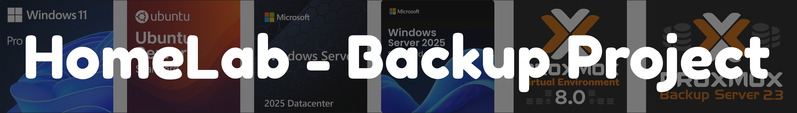
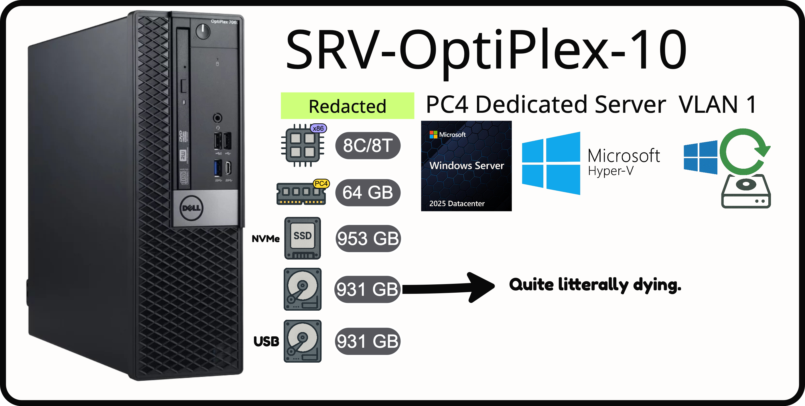
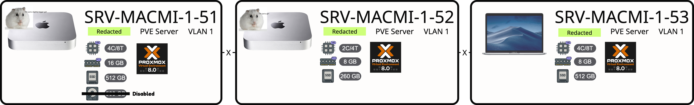

## Project Overview

This project implements a comprehensive backup and restore solution for a multi-hypervisor homelab environment. The system protects approximately 650GB of virtual machines across Proxmox and Hyper-V platforms using industry-standard tools like Veeam and Proxmox Backup Server, with offsite replication to Proton Drive following the 3-2-1 backup rule.

## Module Goals [M143 - ICT-Berufsbildung Schweiz](https://www.modulbaukasten.ch/module/143/3/de-DE?title=Backup--und-Restore-Systeme-implementieren)

**Core Competency**: Design, Implement, and test data backup concepts.

### Learning Objectives Aligned to Project:

1. **Data Security Concept Development** - Implemented 7-1-1 retention policy with daily backups considering data volumes (~650GB), regulatory requirements, and recovery availability
2. **Feasibility Assessment** - Validated concept with current hardware limitations and budget constraints (€0 budget requirement)
3. **Hardware & Storage Planning** - Determined storage requirements across 2 physical disks with "cloud" backup integration
4. **Backup Procedures Implementation** - Deployed automated daily backup jobs (between 02:00-06:00) with Veeam and PBS.
5. **Testing & Validation** - Conducted file-level and full VM restore tests to ensure system reliability
6. **Documentation & Production Release** - Created comprehensive documentation for productive backup system operation

## Project Structure

```

```

## Hardware Overview

### Hypervisor Infrastructure

**Hyper-V Server (Primary Backup Host)**
- **Model**: Dell OptiPlex Server
- **OS**: Windows Server 2025
- **RAM**: 64GB DDR4
- **Storage**: 
  - 1TB NVMe SSD (C:/) - System & primary backups
  - 1TB SATA HDD (B:/) - Secondary backup storage (failing - CRC errors)
  - 1TB USB HDD - Additional backup storage
- **Services**: Hyper-V, Proxmox Backup Server, Veeam Backup & Replication

**Proxmox Cluster Nodes**

| Node | Hardware | CPU | RAM | Storage | Role |
|------|----------|-----|-----|---------|------|
| **Node 1** | Mac Mini 2012 | i7 Quad-core | 16GB DDR3 | 512GB SATA SSD | Primary Proxmox |
| **Node 2** | Mac Mini 2012 | i5 Dual-core | 8GB DDR3 | 256GB SATA SSD | Secondary Proxmox |
| **Node 3** | MacBook Pro 2019 | i5 Quad-core | 8GB DDR3 | 512GB Internal SSD | Cluster Extension |

**Data Volumes**:
- Proxmox VMs: ~350GB
- Hyper-V VMs: ~300GB
- **Total Protected Data**: ~650GB

**Network**: Ubiquiti-based infrastructure with Internal VLAN and DMZ VLAN separation, WireGuard VPN access via Cloud Gateway.

## Key Technologies

- **Backup Software**: Veeam Backup & Replication, Proxmox Backup Server
- **Virtualization**: Microsoft Hyper-V, Proxmox VE
- **Cloud Storage**: Proton Drive (offsite backup)
- **Encryption**: Built-in Veeam and PBS encryption with TLS transport
- **Retention**: 7-1-1 policy (7 daily, 1 weekly, 1 monthly)

---

*Project developed for TBZ Technische Berufsschule Zürich, IT-PE24c*  
*Module 143: Backup- und Restore-Systeme implementieren*
